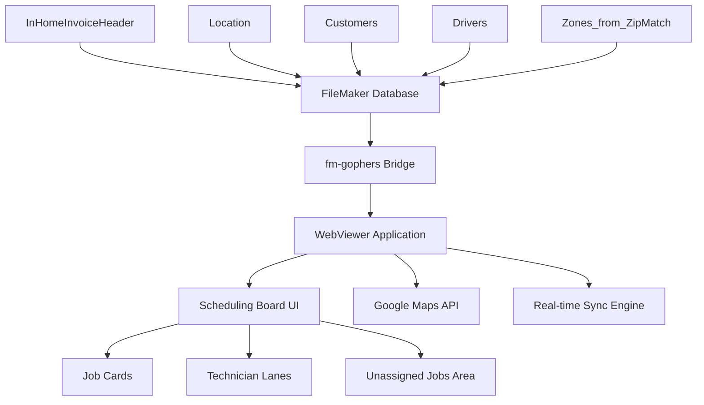
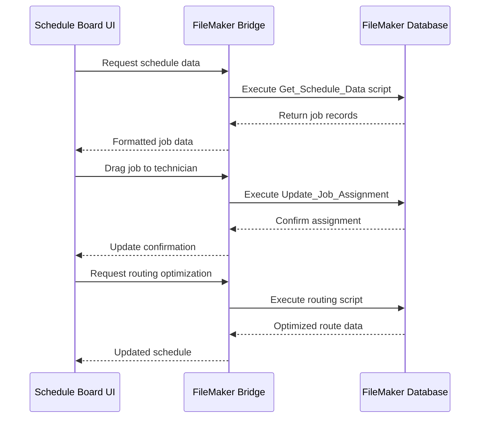

# Carpet Cleaning Dispatch Scheduling Board - Technical Planning Document

## Executive Summary

This document outlines the comprehensive plan for developing a visual scheduling board application for carpet cleaning dispatch management. The application will run in a FileMaker WebViewer and provide drag-and-drop job assignment capabilities, technician management, and real-time synchronization with the existing FileMaker database.

## System Architecture Overview



## Database Schema Analysis

### Core Tables Identified:
- **InHomeInvoiceHeader** (2,883 records) - Main job/invoice records
- **Location** (58,947 records) - Customer locations with address data
- **Customers** (49,050 records) - Customer information
- **Drivers** (15 records) - Technician/driver information (filtered by IHDriver = 1 for carpet cleaning)
- **Zones_from_ZipMatch** (17 records) - Service zone definitions with ZoneID, Zone name, Description, BranchID, ZonePricingID, and Active status

### Key Relationships:
- InHomeInvoiceHeader → Location (via _kf_CustLoc)
- Location → Customers (customer data)
- Location → Zones_from_ZipMatch (via ZoneID for service area assignment)
- Jobs assigned to Drivers for scheduling

## User Interface Design

### Main Layout Structure:
1. **Header Section**
   - Date navigation controls
   - Filter and search functionality
   - Refresh and sync status indicators

2. **Unassigned Jobs Panel** (Left Side)
   - Organized by service date
   - Filterable by job type, zone, priority
   - Drag source for job assignment

3. **Technician Lanes** (Center Area)
   - Dynamic columns for each active technician
   - Timeline view with hourly slots (8AM-5PM residential, 24/7 commercial)
   - Visual capacity indicators

4. **Job Cards**
   - Customer name and contact info
   - Service address and zone
   - Scheduled time and duration
   - Job type and special instructions
   - Status indicators

### Job Card Data Model:
```typescript
interface JobCard {
  id: string;
  primaryKey: string; // InHomeInvoiceHeader Primary Key
  customerId: string;
  locationId: string;
  customerName: string;
  serviceAddress: string;
  zone: string;
  scheduledDate: Date;
  scheduledTime: string;
  estimatedDuration: number;
  jobType: string;
  status: 'unassigned' | 'assigned' | 'in_progress' | 'completed';
  priority: 'low' | 'medium' | 'high';
  specialInstructions: string;
  assignedTechnician?: string;
  createdDate: Date;
  modifiedDate: Date;
  isCommercial: boolean;
}
```

## Technical Implementation Strategy

### Frontend Architecture:
- **Base**: FMbridge-Template structure
- **Framework**: Vanilla TypeScript with modern ES modules
- **Styling**: Tailwind CSS with custom carpet cleaning components
- **Drag & Drop**: Native HTML5 Drag and Drop API
- **State Management**: Custom reactive state system
- **Build Tool**: Vite with FileMaker optimization

### Component Structure:
```
src/
├── components/
│   ├── ScheduleBoard.ts
│   ├── JobCard.ts
│   ├── TechnicianLane.ts
│   ├── UnassignedJobsPanel.ts
│   ├── DateNavigator.ts
│   └── FilterControls.ts
├── services/
│   ├── JobService.ts
│   ├── TechnicianService.ts
│   ├── SyncService.ts
│   └── RoutingService.ts
├── types/
│   ├── Job.ts
│   ├── Technician.ts
│   └── Schedule.ts
└── utils/
    ├── dragDrop.ts
    ├── timeSlots.ts
    └── validation.ts
```

## FileMaker Integration Design

### Required FileMaker Scripts:
1. **Get_Schedule_Data** - Retrieve jobs for date range with zone lookup from Zones_from_ZipMatch
2. **Update_Job_Assignment** - Assign job to technician
3. **Get_Technician_List** - Retrieve active drivers/technicians where IHDriver = 1
4. **Get_Job_Details** - Fetch complete job information with zone details
5. **Update_Job_Status** - Change job status
6. **Get_Zone_List** - Retrieve active zones from Zones_from_ZipMatch
7. **Sync_Schedule_Changes** - Batch update multiple assignments

### Data Flow Architecture:


### FileMaker Script Parameters:
```json
{
  "Get_Schedule_Data": {
    "startDate": "2025-09-05",
    "endDate": "2025-09-07",
    "includeUnassigned": true,
    "technicianFilter": "IHDriver = 1"
  },
  "Get_Technician_List": {
    "activeOnly": true,
    "filterCriteria": "IHDriver = 1"
  },
  "Update_Job_Assignment": {
    "jobId": "uuid-string",
    "technicianId": "driver-id",
    "scheduledTime": "14:30",
    "estimatedDuration": 120
  }
}
```

## Drag and Drop System Design

### Implementation Strategy:
1. **Draggable Job Cards**
   - HTML5 draggable attribute
   - Custom drag preview with job summary
   - Visual feedback during drag operations

2. **Drop Zones**
   - Technician lane time slots
   - Unassigned jobs area for removal
   - Visual drop indicators

3. **Validation Logic**
   - Time slot availability checking
   - Technician capacity validation
   - Schedule conflict detection

### Code Structure:
```typescript
class DragDropManager {
  private draggedJob: JobCard | null = null;
  
  handleDragStart(job: JobCard, event: DragEvent): void
  handleDragOver(event: DragEvent): void
  handleDrop(targetSlot: TimeSlot, event: DragEvent): Promise<void>
  validateDrop(job: JobCard, targetSlot: TimeSlot): boolean
}
```

## Time Slot Management

### Business Rules:
- **Residential Jobs**: 8:00 AM - 5:00 PM (Monday-Saturday)
- **Commercial Jobs**: 24/7 availability
- **Time Slots**: 30-minute increments
- **Buffer Time**: 15 minutes between jobs for travel

### Time Slot Data Structure:
```typescript
interface TimeSlot {
  startTime: string; // "14:30"
  endTime: string;   // "16:00"
  isAvailable: boolean;
  assignedJob?: JobCard;
  technicianId: string;
  date: Date;
  slotType: 'residential' | 'commercial';
}
```

## Real-Time Synchronization

### Sync Strategy:
1. **Polling Mechanism**: Check for changes every 30 seconds
2. **Event-Driven Updates**: Immediate sync on user actions
3. **Conflict Resolution**: Last-write-wins with user notification
4. **Offline Handling**: Queue changes when connection lost

### Sync Service Implementation:
```typescript
class SyncService {
  private syncInterval: number = 30000; // 30 seconds
  private pendingChanges: ScheduleChange[] = [];
  
  startSync(): void
  syncScheduleData(): Promise<void>
  handleConflict(localChange: ScheduleChange, serverChange: ScheduleChange): void
  queueChange(change: ScheduleChange): void
}
```

## Performance Optimization

### Loading Strategy:
- **Initial Load**: Current day + next 2 days
- **Lazy Loading**: Additional days on demand
- **Caching**: Store frequently accessed data in browser storage
- **Virtualization**: Render only visible time slots

### Memory Management:
- **Component Cleanup**: Remove event listeners on unmount
- **Data Pruning**: Remove old schedule data automatically
- **Image Optimization**: Compress and cache customer photos

## Scalability Considerations

### Current Scale:
- 15 technicians
- ~2,883 active jobs
- 2 service zones
- 58,947 locations

### Growth Projections:
- Support up to 50 technicians
- Handle 10,000+ active jobs
- Expand to 10+ service zones
- Maintain sub-2-second load times

### Technical Scalability:
- **Database Indexing**: Ensure proper indexes on date/technician fields
- **API Pagination**: Implement server-side pagination
- **Client-Side Filtering**: Reduce server load
- **CDN Integration**: Cache static assets

## Integration with Google Maps API

### Routing Optimization:
1. **Route Calculation**: Optimize daily routes for each technician
2. **Travel Time Estimation**: Account for traffic and distance
3. **Geofencing**: Validate service areas
4. **Address Validation**: Ensure accurate location data

### Implementation:
```typescript
class RoutingService {
  async optimizeRoute(jobs: JobCard[], startLocation: string): Promise<OptimizedRoute>
  async calculateTravelTime(origin: string, destination: string): Promise<number>
  async validateServiceArea(address: string, zone: string): Promise<boolean>
}
```

## Error Handling and Resilience

### Error Categories:
1. **Network Errors**: Connection timeouts, server unavailable
2. **Data Conflicts**: Concurrent modifications
3. **Validation Errors**: Invalid assignments, time conflicts
4. **System Errors**: FileMaker script failures

### Recovery Strategies:
- **Retry Logic**: Exponential backoff for network errors
- **User Notifications**: Clear error messages and suggested actions
- **Fallback Data**: Use cached data when server unavailable
- **Manual Sync**: Allow users to trigger manual synchronization

## Security Considerations

### Data Protection:
- **Input Validation**: Sanitize all user inputs
- **XSS Prevention**: Escape HTML content
- **CSRF Protection**: Validate request origins
- **Data Encryption**: Secure sensitive customer information

### Access Control:
- **Role-Based Access**: Different permissions for dispatchers vs. technicians
- **Session Management**: Automatic logout after inactivity
- **Audit Logging**: Track all schedule changes

## Testing Strategy

### Unit Testing:
- Component functionality
- Drag and drop logic
- Time slot validation
- Data transformation

### Integration Testing:
- FileMaker script communication
- Real-time synchronization
- Error handling scenarios

### User Acceptance Testing:
- Dispatcher workflow validation
- Performance under load
- Mobile device compatibility

## Deployment Plan

### Development Phases:
1. **Phase 1**: Core scheduling board with basic drag-and-drop
2. **Phase 2**: FileMaker integration and real-time sync
3. **Phase 3**: Routing optimization and advanced features
4. **Phase 4**: Performance optimization and scalability

### Deployment Strategy:
1. **Development Environment**: Local FileMaker server
2. **Staging Environment**: Production-like testing
3. **Production Rollout**: Gradual deployment with rollback plan
4. **Training**: User training and documentation

## Success Metrics

### Key Performance Indicators:
- **Load Time**: < 2 seconds for initial board load
- **Sync Latency**: < 5 seconds for assignment updates
- **User Adoption**: 90% of dispatchers using within 30 days
- **Error Rate**: < 1% of operations result in errors

### Business Metrics:
- **Scheduling Efficiency**: Reduced time to assign jobs
- **Route Optimization**: Improved technician utilization
- **Customer Satisfaction**: Fewer scheduling conflicts

## Maintenance and Support

### Ongoing Maintenance:
- **Regular Updates**: Monthly feature releases
- **Performance Monitoring**: Continuous performance tracking
- **Bug Fixes**: Rapid response to critical issues
- **User Feedback**: Regular feedback collection and implementation

### Documentation:
- **User Manual**: Step-by-step usage instructions
- **Technical Documentation**: API reference and architecture guide
- **Troubleshooting Guide**: Common issues and solutions

## Conclusion

This comprehensive plan provides a roadmap for developing a robust, scalable carpet cleaning dispatch scheduling board that integrates seamlessly with the existing FileMaker infrastructure while providing modern, intuitive user experience for dispatch management.

The implementation will leverage the proven FMbridge-Template patterns while introducing specialized components for scheduling, drag-and-drop interactions, and real-time synchronization to create a powerful tool for optimizing carpet cleaning operations.